### AIT - Labo3 

**Auteurs:** Barros Henriques Chris, Daubresse Gaëtan, Noël Eric


### Task1


> 1. Explain how the load balancer behaves when you open and refresh the
>    URL <http://192.168.42.42> in your browser. Add screenshots to
>    complement your explanations. We expect that you take a deeper a
>    look at session management.

On voit que le load balancer nous fait passer alternativement d'un serveur à l'autre. On remarque aussi qu'une nouvelle session est créée à chaque requête. On le déduit du fait que la variable *sessionView* ne change pas et que l'id de session quant à lui change.

```
# Premier JSON obteu après accès à la page
{"hello":"world!","ip":"192.168.42.22","host":"dec2aacceecb","tag":"s2","sessionViews":1,"id":"St42YWoXZqLxqULOxNg6MKkdb6lrHfoI"}


# JSON obtenu après rafraîchissement de la page depuis le browser
{"hello":"world!","ip":"192.168.42.22","host":"dec2aacceecb","tag":"s2","sessionViews":1,"id":"St42YWoXZqLxqULOxNg6MKkdb6lrHfoI"}
```


On peut le prouver en réinjectant le cookie généré par S1 lorsque l'on refait une requête vers celui-ci. Nous avons utilisé Burp comme cela:

**Requête 1:** On se connecte pour la première fois à S1, celui-ci nous envoie un cookie que nous interceptons et sauvegardons grâce à Burp. On obtient l'affichage suivant:

```
{"hello":"world!","ip":"192.168.42.11","host":"ab6d4d299d1b","tag":"s1","sessionViews":1,"id":"TaVIsL0EBYPvq8hoC5MilEQa8rFbrOdF"}
```

**Requête 2:** On réactualise la page pour joindre S2 pour pouvoir atteindre S1 à la prochaine requête faite.

**Requête 3:** On intercepte la requête envoyée côté cliet et on réinjecte le cookie. On voit que S1 reconnaît la session grâce au cookie et a incrémenté *sessionView*

 ```
{"hello":"world!","ip":"192.168.42.11","host":"ab6d4d299d1b","tag":"s1","sessionViews":2,"id":"TaVIsL0EBYPvq8hoC5MilEQa8rFbrOdF"}
 ```


> 2. Explain what should be the correct behavior of the load balancer for
>    session management.

Lorsqu'une session est crée, le load balancer devrait rediriger le client vers le même serveur, ce qui implique que l'id de session ne devrait pas changer et *sessionView* s'incrémenter comme indiqué au point 1. Ceci pourrait se faire notamment à l'aide de Cookies.


> 3. Provide a sequence diagram to explain what is happening when one
>    requests the URL for the first time and then refreshes the page. We
>    want to see what is happening with the cookie. We want to see the
>    sequence of messages exchanged (1) between the browser and HAProxy
>    and (2) between HAProxy and the nodes S1 and S2. Here is an example:
>
>   

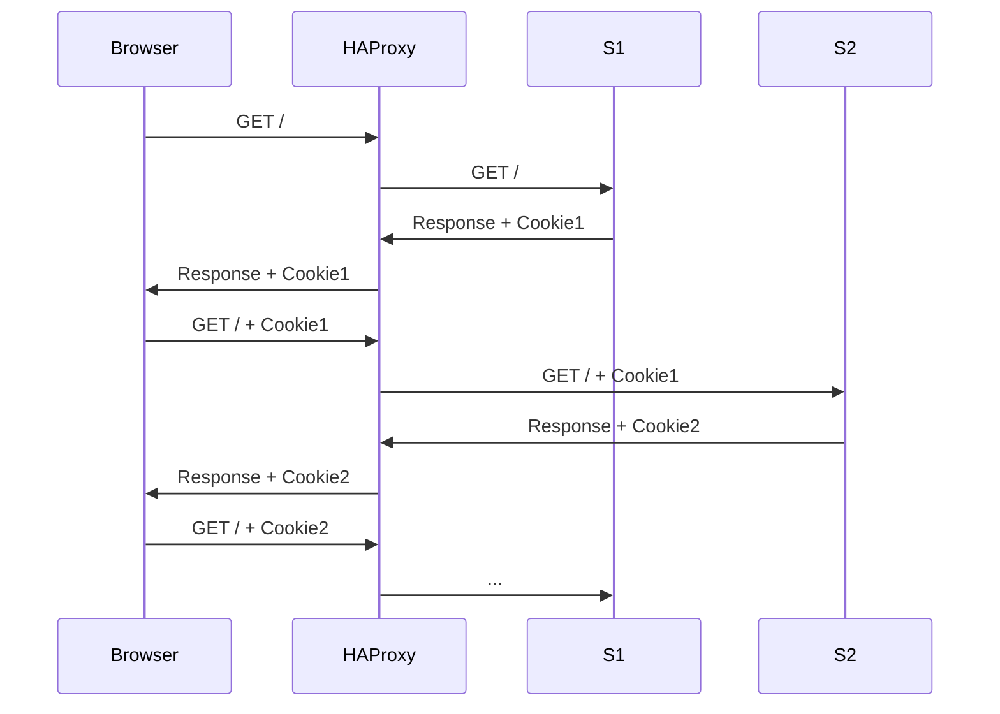


> 4. Provide a screenshot of the summary report from JMeter.

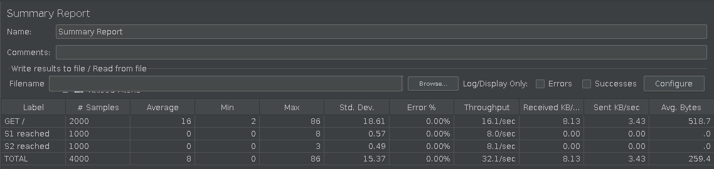


> 5. Run the following command:
>
>   ```bash
>   $ docker stop s1
>   ```
>
>   Clear the results in JMeter and re-run the test plan. Explain what
>   is happening when only one node remains active. Provide another
>   sequence diagram using the same model as the previous one.

On voit que si un serveur est down, les requêtes sont redirigées vers l'autre serveur.

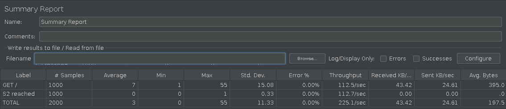

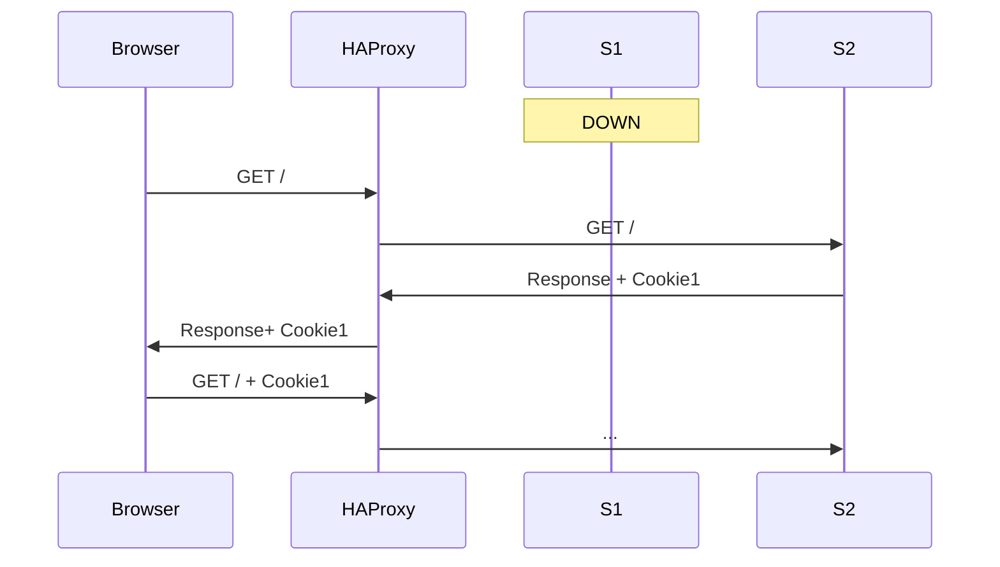

### Task 2


> 1. There is different way to implement the sticky session. One possibility is to use the SERVERID provided by HAProxy. Another way is to use the NODESESSID provided by the application. Briefly explain the difference between both approaches (provide a sequence diagram with cookies to show the difference).
>
>   * Choose one of the both stickiness approach for the next tasks.

**NODESESSID:**

L'application se trouvant sur l'un des serveurs génèrent un Cookie contenant un NODESESSID, puis l'envoie dans sa réponse au load balancer. Le load balancer préfixe ensuite l'ID précédent avec un tout nouvel ID.

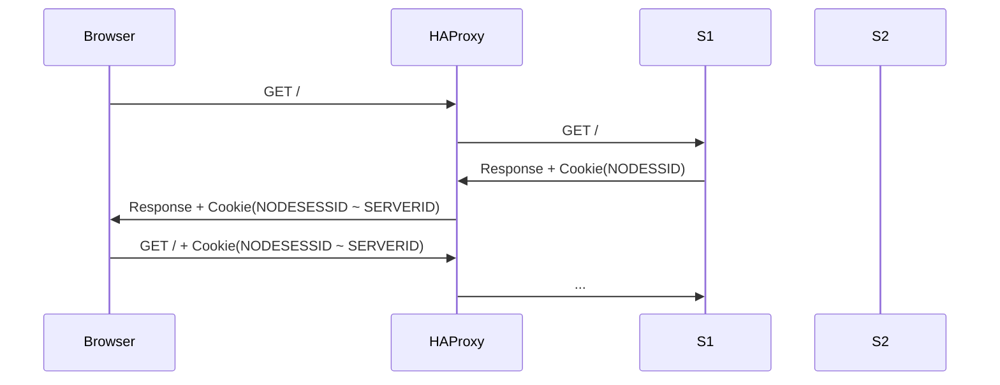

**SERVERID:**

L'application génère également un NODESESSID à la réponse destinée au load balancer. Mais cette fois-ci, le load balancer génère un nouveau cookie appelé SERVERID puis envoie les deux cookies lors de sa réponse au client. 

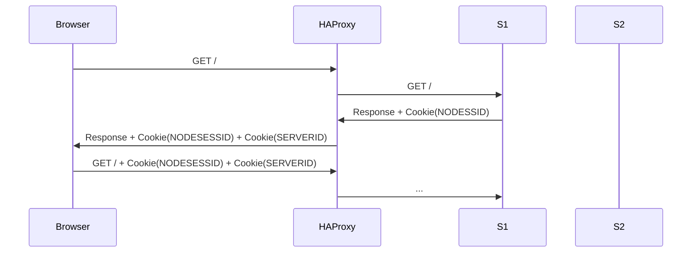

Dans les deux cas, le load balancer pourra savoir à quel serveur rediriger la requête grâce à une table qu'il aura généré, liant un SERVERID avec un serveur.


> 2. Provide the modified `haproxy.cfg` file with a short explanation of
>    the modifications you did to enable sticky session management.


On a choisi la méthode avec le SERVERID. HAProxy va donc générer un nouveau cookie qui sera envoyé au client. Cecci est spécifie grâce à `    cookie SERVERID insert indirect nocache`. Le load balancer sait vers qui rediriger la requête grâce à `check cookie sX`. 

```
    #Add cookie policy
    cookie SERVERID insert indirect nocache
    # Define the list of nodes to be in the balancing mechanism
    # http://cbonte.github.io/haproxy-dconv/2.2/configuration.html#4-server
    server s1 ${WEBAPP_1_IP}:3000 check cookie s1
    server s2 ${WEBAPP_2_IP}:3000 check cookie s2
```


> 3. Explain what is the behavior when you open and refresh the URL
>    <http://192.168.42.42> in your browser. Add screenshots to
>    complement your explanations. We expect that you take a deeper a
>    look at session management.

On voit que lorsque l'on se connecte pour la première fois, on arrive sur un serveur précis et que la variable *sessionViews* est à 1:

```
{"hello":"world!","ip":"192.168.42.22","host":"1c9799a4d16f","tag":"s2","sessionViews":1,"id":"vrufdNfGvhuq0XvLScBzTYTLqcKuZj7F"}
```


Puis lorsque l'on actualise la page, on voit que le *sessionView* s'incrémente et que l'id et le host reste identique:

```
{"hello":"world!","ip":"192.168.42.22","host":"1c9799a4d16f","tag":"s2","sessionViews":2,"id":"vrufdNfGvhuq0XvLScBzTYTLqcKuZj7F"}
```

Ceci nous montre que la confiuration du sticky session fonctionne correctement.


On remarque aussi que logiquement, si on ouvre une nouvelle navigation privée, une nouvelle session est créée (*sessionViews* à 1) et on a tout de même changé de serveur.


Nous remarquons que le client renvoie bien 2 cookies au serveur lors de ses requêtes suivantes:

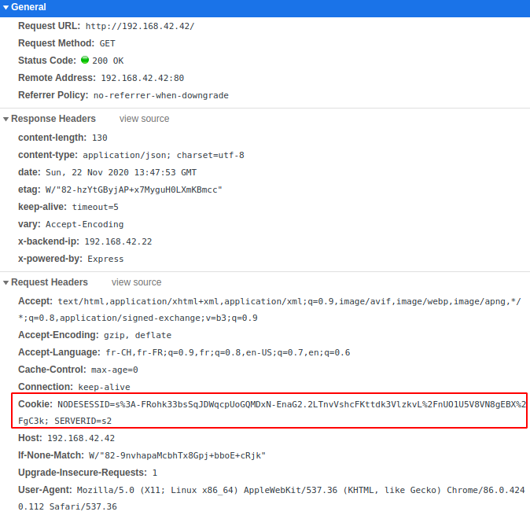


> 4. Provide a sequence diagram to explain what is happening when one
>    requests the URL for the first time and then refreshes the page. We
>    want to see what is happening with the cookie. We want to see the
>    sequence of messages exchanged (1) between the browser and HAProxy
>    and (2) between HAProxy and the nodes S1 and S2. We also want to see
>    what is happening when a second browser is used.


> 5. Provide a screenshot of JMeter's summary report. Is there a
>    difference with this run and the run of Task 1?
>
>   * Clear the results in JMeter.
>   * Now, update the JMeter script. Go in the HTTP Cookie Manager and
>     <del>uncheck</del><ins>verify that</ins> the box `Clear cookies each iteration?`
>     <ins>is unchecked</ins>.
>   * Go in `Thread Group` and update the `Number of threads`. Set the value to 2.


Sur cette capture, les cookies sont conservés entre chaque requête ce qui a pour conséquence qu'on atteint toujours le même serveur.

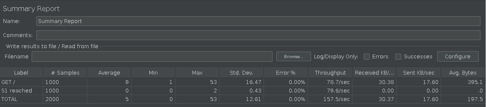


> 6. Provide a screenshot of JMeter's summary report. Give a short
>    explanation of what the load balancer is doing.


On voit que le serveur réagit comme si un autre ordinateur s'était connecté et on obtient le fonctionnement attendu.

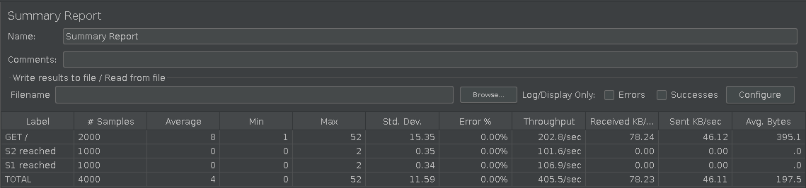


### Task 3: Drain mode


> 1. Take a screenshot of the Step 5 and tell us which node is answering.
>

On peut voir que c'est le serveur s2 qui a répondu. 

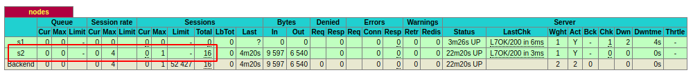

> 2. Based on your previous answer, set the node in DRAIN mode. Take a screenshot of the HAProxy state page.

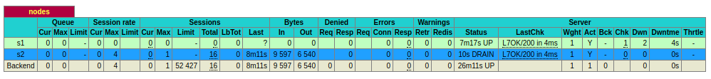


> 3. Refresh your browser and explain what is happening. Tell us if you stay on the same node or not. If yes, why? If no, why?

Oui, nous restons sur la même node. Le principe du mode drain consiste a accepter uniquement les connexions ayant déjà été enregistrée grâce à la persistance. Toute nouvel connexion ne sera pas rediriger vers le node ou ce mode à été activé. 

> 4. Open another browser and open `http://192.168.42.42`. What is happening?

Si nous ouvrons un autre browser par exemple chrome puis firefox, les cookies ne seront pas les mêmes. Nous sommes donc rediriger vers s1 puisqu'il n'est pas en drain mode et accepte donc les nouvelles connexions. 

> 5. Clear the cookies on the new browser and repeat these two steps multiple times. What is happening? Are you reaching the node in DRAIN mode?

Si les cookies sont supprimés toutes les requêtes ouvriront de nouvels sessions, elles seront donc toutes redirigée vers s1 qui n'est pas en drain mode. 

> 6. Reset the node in READY mode. Repeat the three previous steps and explain what is happening. Provide a screenshot of HAProxy's stats page.

Une fois le state ready reactivé c'est à nouveau la politique du round robin avec sticky session qui s'applique. S'il il n'y a pas de session on est redirigé alternativement d'une node à l'autre. Si une session est enregistrée on sera redirigé vers la node concernée.  

> 7. Finally, set the node in MAINT mode. Redo the three same steps and explain what is happening. Provide a screenshot of HAProxy's stats page.

Le mode maint n'accepte plus aucune connexion. Toutes les requêtes seront donc redirigées vers l'autre node. 